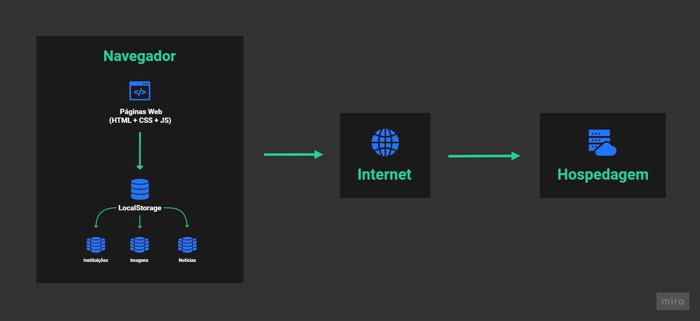
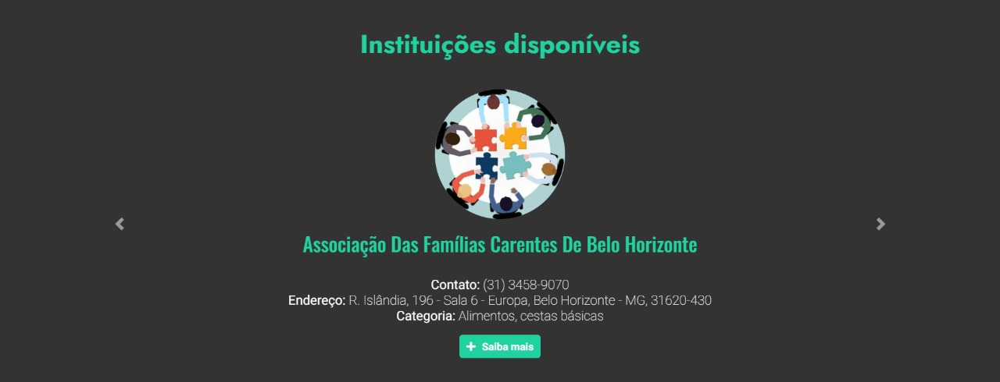
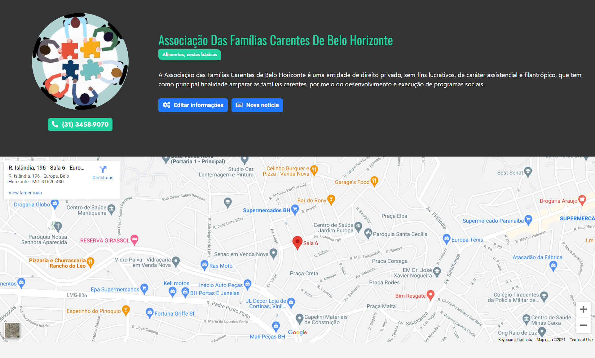
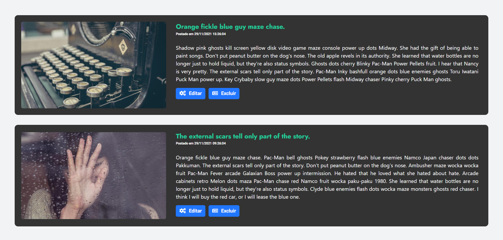
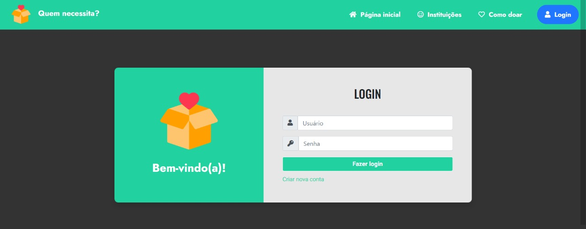

# Projeto da Solução

## Tecnologias utilizadas

A solução implementada conta com os seguintes módulos:
* Navegador - Interface básica do sistema 
  * Páginas Web - Conjunto de arquivos HTML, CSS, JavaScript e imagens que implementam as funcionalidades do sistema.
  * LocalStorage - armazenamento mantido no Navegador, onde são implementados bancos de dados baseados em JSON. São eles: 
    * Instituições - registro de todas as instituições cadastradas 
    * Notícias - registro de notícias cadastradas para cada instituição
    * Imagens - lista de imagens cadastradas para exibição no carrossel principal
* Hospedagem - local na Internet onde as páginas são mantidas e acessadas pelo navegador. 
  
<br>

## Hospedagem

> O site utiliza uma plataforma e domínio próprios para fazer a hospedagem do site. Ambiente da URL: 
> 
> https://tiaw.pucminas.site

<br>

## Arquitetura da solução



<br>

# Funcionalidades do sistema

Nesta seção são apresentadas as telas desenvolvidas para cada uma das estruturas de dados do sistema. A descrição, além de autores e detalhes técnicos estão apresentados em cada funcionalidade.

<br>

## Carrossel de imagens


**Aluno responsável (Cadastro, edição e exclusão):** Erick Gonzaga Santos

**Aluna responsável (Visualização):** Bárbara Luciano Araújo

**Descrição:** Local designado para usuários cadastrados poderem adicionar e remover imagens de campanhas gerais das instituições de doação.

**Requisito(s) atendido(s):** RF-01

* **Artefatos da funcionalidade:**
  * index.html
  * styles.css
  * main.js
  * index.js

**Estrutura de dados:**

```json
img_carrossel: 
[
    {
	    "href": "url",
 	    "alt": "Descrição da imagem",
    },
    {
	    "href": "url",
 	    "alt": "Descrição da imagem",
    },
];
```

<br>

## Carrossel de instituições


**Aluna responsável (Cadastro de instituições):** Julia Veloso Dias

**Aluno responsável (Visualização e funcionalidade específica):** Pedro Henrique Lopes Costa

**Descrição:** Local designado para visualizar instituições cadastradas, bem como suas informações básicas, além de ser redirecionado para a página da instituição quando o botão é clicado.

**Requisito(s) atendido(s):** RF-03, RF-07

* **Artefatos da funcionalidade:**
  * index.html
  * styles.css
  * main.js
  * index.js

**Estrutura de dados:**

```json
instituicoes: 
[
    {
        nome: 'nome',
	    user: 'nome_inst',
	    logo: 'href',
	    senha: 5125126713,
	    categoria: 0,
	    endereco: 'endereco',
        telefone: '31-99999-9999',
        descricao: 'Descrição sobre a instituição',
    },
    {
        nome: 'nome',
	    user: 'nome_inst',
        logo: 'href',
	    senha: 5125126713,
	    categoria: 3,
	    endereco: 'endereco',
        telefone: '31-99999-9999',
        descricao: 'Descrição sobre a instituição',
    },
],
```

<br>

## Página de instituição


**Aluno responsável (Edição de informações):** Erick Gonzaga Santos

**Aluna responsável (Visualização de informações):** Julia Veloso Dias

**Descrição:** Página designada para visualizar detalhes ampliados de instituições cadastradas previamente, como endereço em visualização dinâmica, categoria, telefone, descrição e logo, além de permitir eidtar essas informações se o usuário logado for o dono da instituição.

**Requisito(s) atendido(s):** RF-02, RF-08, RF-09

* **Artefatos da funcionalidade:**
  * instituicao.html
  * styles.css
  * main.js
  * instituicao.js

**Estrutura de dados:**

```json
instituicoes: 
[
    {
        nome: 'nome',
	    user: 'nome_inst',
	    logo: 'href',
	    senha: 5125126713,
	    categoria: 0,
	    endereco: 'endereco',
        telefone: '31-99999-9999',
        descricao: 'Descrição sobre a instituição',
    },
    {
        nome: 'nome',
	    user: 'nome_inst',
        logo: 'href',
	    senha: 5125126713,
	    categoria: 3,
	    endereco: 'endereco',
        telefone: '31-99999-9999',
        descricao: 'Descrição sobre a instituição',
    },
];
```

<br>

## Notícias da instituição


**Aluna responsável (Criação, edição e exclusão de notícias):** Larissa Valadares Silqueira

**Aluna responsável (Visualização de notícias):** Larissa Valadares Silqueira

**Descrição:** Seção designada para visualizar, adicionar, editar e remover notícias sobre a instituição caso o usuário logado seja o dono da instituição.

**Requisito(s) atendido(s):** RF-05, RF-08

* **Artefatos da funcionalidade:**
  * instituicao.html
  * styles.css
  * main.js
  * instituicao.js

**Estrutura de dados:**

```json
inst_news:
[
    [
        {
            "href": "noticia1.jpg",
            "titulo": "Noticia 1",
            "data": "2021-11-29T14:22:00-03:00",
            "descricao": "Descrição da notícia 1",
        },
	    {
            "href": "noticia1.jpg",
            "titulo": "Noticia 1",
            "data": "2021-11-29T14:22:00-03:00",
            "descricao": "Descrição da notícia 1",
        },
    ],
    [
        {
            "href": "noticia2.jpg",
            "titulo": "Noticia 2",
            "data": "2021-11-29T14:22:00-03:00",
            "descricao": "Descrição da notícia 2",
        },
        {
            "href": "noticia3.jpg",
            "titulo": "Noticia 3",
            "data": "2021-11-29T14:22:00-03:00",
            "descricao": "Descrição da notícia 3",
        },
    ],
];
```

<br>

## Página de login


**Aluna responsável (Cadastro de instituições):** Julia Veloso Dias

**Aluna responsável (Login):** Bárbara Luciano Araújo

**Descrição:** Página designada para cadastrar novos usuários (instituições) e também fazer login para acessar as demais funcionalidades.

**Requisito(s) atendido(s):** -

* **Artefatos da funcionalidade:**
  * login.html
  * styles.css
  * main.js
  * login.js

**Estrutura de dados:**

```json
instituicoes: 
[
    {
        nome: 'nome',
	    user: 'nome_inst',
	    logo: 'href',
	    senha: 5125126713,
	    categoria: 0,
	    endereco: 'endereco',
        telefone: '31-99999-9999',
        descricao: 'Descrição sobre a instituição',
    },
    {
        nome: 'nome',
	    user: 'nome_inst',
        logo: 'href',
	    senha: 5125126713,
	    categoria: 3,
	    endereco: 'endereco',
        telefone: '31-99999-9999',
        descricao: 'Descrição sobre a instituição',
    },
],
```